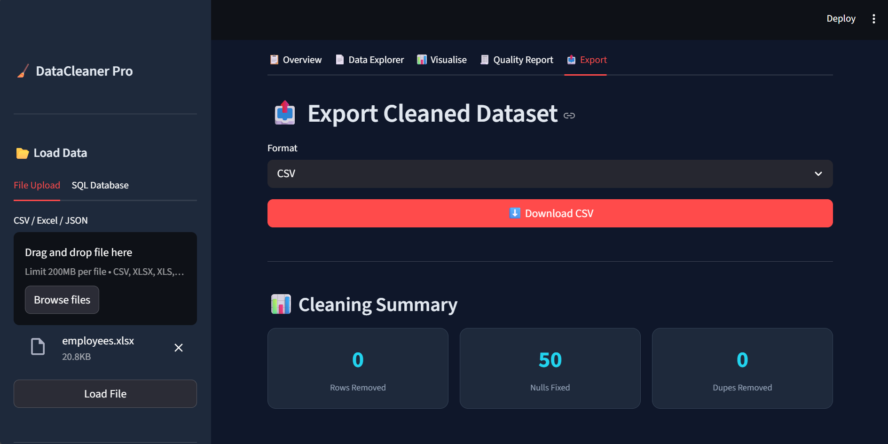
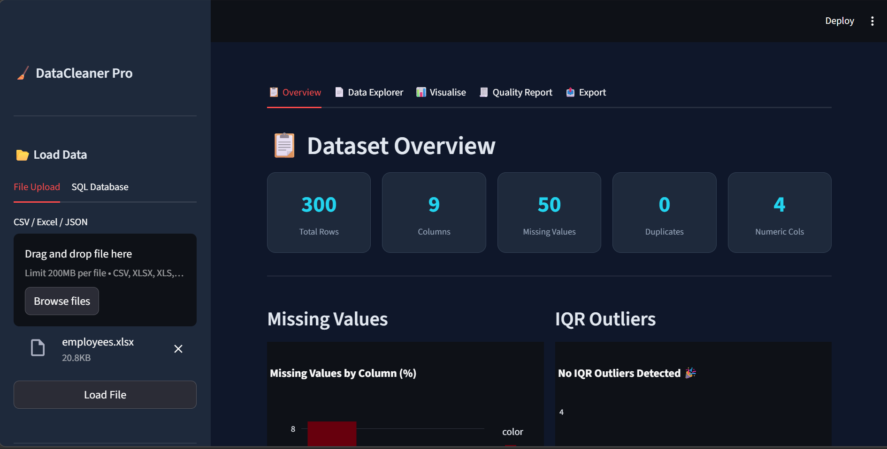

## DataCleaner Pro 

A production-ready Python tool for **automated data cleaning, quality reporting, and interactive visualisation**. Supports CSV, Excel, JSON, and SQL databases with a full Streamlit dashboard.
https://datacleaner-pro.streamlit.app/
---

##  Project Structure

```
data_cleaner/
├── app.py             # Streamlit dashboard (main entry point)
├── main.py            # CLI batch-cleaning script
├── cleaner.py         # Core cleaning & detection logic
├── loader.py          # Multi-format data loader (CSV/Excel/JSON/SQL)
├── visualizer.py      # Plotly interactive + Matplotlib static charts
├── reporter.py        # HTML (& optional PDF) report generator
├── make_examples.py   # Generate sample datasets for testing
├── requirements.txt   # Python dependencies
├── data/              # (auto-created by make_examples.py)
└── datacleaner.log    # (auto-created on CLI runs)
```

---

## Installation

**Python 3.9+ required.**

```bash
# 1. Clone / copy the project folder
cd data_cleaner

# 2. Create a virtual environment (recommended)
python -m venv .venv
source .venv/bin/activate
# Windows: .venv\Scripts\activate

# 3. Install dependencies
pip install -r requirements.txt

- **Linux:**   `sudo apt install python3-weasyprint`
- **macOS:**   `brew install weasyprint && pip install weasyprint`
- **Windows:** See [WeasyPrint Windows instructions](https://doc.courtbouillon.org/weasyprint)
#    Windows: see https://doc.courtbouillon.org/weasyprint
```

---

## Quick Start

### 1. You can generate example datasets (skip this step if you already have your own datasets)

```bash
# Creates: data/sales.csv, data/employees.xlsx
#          data/sensors.json, data/store.db
#          data/sensors.json, data/store.db
```

### 2. Launch the interactive dashboard

```bash
streamlit run app.py
# Opens http://localhost:8501 in your browser
```

### 3. Batch clean from the command line

```bash
# Clean a CSV file
python main.py -i data/sales.csv -o out/sales_clean.csv

# With full options
python main.py \
  -i data/sensors.json \
  -o out/sensors_clean.csv \
  --impute median \
  --outlier iqr cap \
  --anomaly-detection \
  --report out/report.html \
  --charts out/charts/

# From a SQL database
python main.py \
  --sql "sqlite:///data/store.db" \
  --query "SELECT * FROM products" \
  -o out/products_clean.csv \
  --report out/products_report.html
```

---

## Dashboard Guide

| Tab                | What you can do                                                                   |
| ------------------ | --------------------------------------------------------------------------------- |
| **Overview**       | KPI cards, missing-values bar chart, outlier chart, auto-suggestions              |
| **Data Explorer**  | Browse raw or cleaned data, filter columns, see descriptive stats, view anomalies |
| **Visualise**      | Histogram, Boxplot, Bar, Pie, Correlation Heatmap; raw vs cleaned comparison      |
| **Quality Report** | Full column-level quality table, download HTML report                             |
| **Export**         | Download cleaned data as CSV / Excel / JSON                                       |

### First Appearance
 

### Second Appearance


## Data Quality Report


## CLI Reference

```
python main.py [OPTIONS]

  -i / --input FILE          Input file path (CSV/Excel/JSON)
  -o / --output FILE         Output file path (required)
  --sql CONNECTION_STRING    SQLAlchemy URL
  --query SQL_OR_TABLE       SELECT query or table name (use with --sql)
  --impute STRATEGY          auto | mean | median | mode | skip  (default: auto)
  --no-fix-types             Skip automatic type coercion
  --no-dedup                 Skip duplicate removal
  --outlier METHOD ACTION    e.g. iqr cap | zscore remove
  --anomaly-detection        Run Isolation Forest; saves anomalies.csv
  -r / --report PATH         Save HTML quality report
  --charts DIR               Save static chart PNGs to DIR
```

---

## Module API

### `loader.py`

```python
from loader import load_auto, save_dataframe

df = load_auto("data.csv")
df = load_auto("data.xlsx", sheet_name="Sheet2")
df = load_auto("data.json")
df = load_auto("", connection_string="sqlite:///db.sqlite",
               sql_query="SELECT * FROM orders")

save_dataframe(df, "output.csv")   # also supports .xlsx and .json
```

### `cleaner.py`

```python
from cleaner import (
    detect_missing, detect_duplicates, detect_outliers_iqr,
    impute_missing, fix_types, remove_duplicates, handle_outliers,
    detect_anomalies_isolation_forest, build_quality_report,
    suggest_cleaning_strategies,
)

report = build_quality_report(df)
df = impute_missing(df, strategy="median")
df = fix_types(df)
df = remove_duplicates(df)
df = handle_outliers(df, method="iqr", action="cap")
anomaly_mask = detect_anomalies_isolation_forest(df, contamination=0.05)
```

### `visualizer.py`

```python
from visualizer import (
    plotly_histogram, plotly_boxplot, plotly_bar, plotly_pie,
    plotly_correlation_heatmap, plotly_missing_bar,
)
fig = plotly_histogram(df, "price")
fig.show()
```

### `reporter.py`

```python
from reporter import generate_html_report, generate_pdf_report
generate_html_report(report, suggestions, chart_paths=[], output_path="report.html")
generate_pdf_report("report.html", "report.pdf")   # needs WeasyPrint
```

---

## Example Datasets

| File                  | Rows | Issues included                                               |
| --------------------- | ---- | ------------------------------------------------------------- |
| `data/sales.csv`      | ~515 | Missing quantity/price, outliers in unit_price, 15 duplicates |
| `data/employees.xlsx` | 300  | Salary stored as string, mixed date formats, missing values   |
| `data/sensors.json`   | 400  | Temperature/humidity outliers every ~80 rows, null status     |
| `data/store.db`       | 200  | Missing price & rating (SQLite, table: `products`)            |

---

## Tech Stack

| Purpose            | Library               |
| ------------------ | --------------------- |
| Data manipulation  | pandas, numpy         |
| Statistics / ML    | scipy, scikit-learn   |
| Static charts      | matplotlib, seaborn   |
| Interactive charts | plotly                |
| Dashboard          | streamlit             |
| SQL connections    | sqlalchemy            |
| Excel read/write   | openpyxl, xlrd        |
| PDF export         | weasyprint (optional) |

---

## Logging

All pipeline steps are logged to both the console and `datacleaner.log`. The log level can be changed by modifying the `LOG_LEVEL` variable (or the relevant logging configuration) at the top of `main.py`.
All pipeline steps are logged to both the console and `datacleaner.log`. Log level can be changed at the top of `main.py`.

---

## Contributing

1. Fork the repo and create a feature branch.
2. Add/update unit tests in `tests/`.
3. Ensure `ruff check .` passes (or equivalent linter).
4. Open a pull request.
